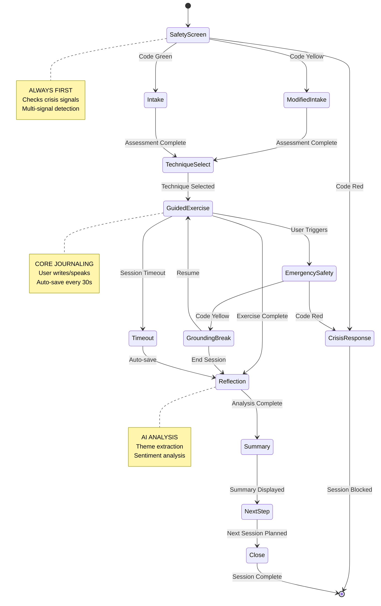

# LangGraph State Machine - Journaling Session Workflow
## Therapeutic Journaling Module - State Machine Design

**Version:** 1.0
**Date:** 2026-02-11
**Service:** Journaling Station (Port 8140)

---

## STATE MACHINE OVERVIEW



---

## STATE DEFINITIONS

### State 1: SafetyScreen

**Purpose:** First-line safety check before any journaling

**Inputs:**
```json
{
  "user_id": "uuid",
  "session_context": {
    "recent_journaling_sessions": 5,
    "last_safety_status": "green",
    "recent_themes": ["conflict", "anger"],
    "sentiment_trend": "declining"
  },
  "user_input": "optional pre-session message"
}
```

**Tool Calls:**
1. `safety_screen()` - Safety Guardian Service (8005)
2. `retrieve_rag()` - Get crisis response templates

**Processing:**
```python
async def safety_screen_state(state: JournalingState) -> JournalingState:
    # Call Safety Guardian
    safety_result = await safety_service.check(
        user_id=state.user_id,
        context="journaling_initiation",
        recent_sessions=state.session_context.recent_journaling_sessions
    )
    
    # Multi-signal detection
    signals = {
        "explicit_ideation": check_explicit_ideation(state.user_input),
        "behavioral_change": check_behavioral_change(state.session_context),
        "sentiment_drop": check_sentiment_drop(state.session_context),
        "recent_triggers": check_recent_triggers(state.session_context)
    }
    
    # Determine status
    if safety_result.status == "red" or signals["explicit_ideation"]:
        state.safety_status = "red"
        state.next_state = "CrisisResponse"
    elif safety_result.status == "yellow" or sum(signals.values()) >= 2:
        state.safety_status = "yellow"
        state.next_state = "ModifiedIntake"
    else:
        state.safety_status = "green"
        state.next_state = "Intake"
    
    state.safety_constraints = safety_result.constraints
    return state
```

**Outputs:**
```json
{
  "safety_status": "green|yellow|red",
  "crisis_level": "none|low|medium|severe",
  "constraints": ["no_unsent_letter", "gentle_pacing"],
  "next_state": "Intake|ModifiedIntake|CrisisResponse"
}
```

**Failure Modes:**
- Safety service unavailable → Default to Code Yellow (conservative)
- LLM timeout → Retry 3x, then Code Yellow
- Invalid user_id → Reject session

**Transition Criteria:**
- `status == "red"` → CrisisResponse
- `status == "yellow"` → ModifiedIntake
- `status == "green"` → Intake

---

### State 2: CrisisResponse

**Purpose:** Handle Code Red crisis, provide resources, block session

**Inputs:**
```json
{
  "user_id": "uuid",
  "safety_status": "red",
  "crisis_level": "severe",
  "detection_signals": ["explicit_ideation", "behavioral_change"]
}
```

**Tool Calls:**
1. `retrieve_rag()` - Get region-specific crisis resources
2. `save_journal_entry()` - Log crisis event (hashed)
3. `notify_hitl()` - Urgent escalation

**Processing:**
```python
async def crisis_response_state(state: JournalingState) -> JournalingState:
    # Get crisis resources
    resources = await graphrag_service.retrieve(
        query="crisis_resources",
        filters={"region": state.user_location}
    )
    
    # Generate crisis response
    response = render_template(
        template="CRISIS_SUICIDAL_IDEATION_v3",
        resources=resources
    )
    
    # Log crisis event (privacy-preserving)
    await save_crisis_log(
        user_id=state.user_id,
        input_hash=hash_input(state.user_input),
        crisis_level="severe",
        resources_provided=resources
    )
    
    # Escalate to HITL (urgent)
    await notify_hitl(
        user_id=state.user_id,
        priority="urgent",
        context="journaling_crisis"
    )
    
    # Block session
    state.session_blocked = True
    state.crisis_response = response
    state.next_state = "END"
    
    return state
```

**Outputs:**
```json
{
  "session_blocked": true,
  "crisis_response": {
    "message": "Your safety is our priority...",
    "resources": [
      {"name": "988 Suicide & Crisis Lifeline", "contact": "988"},
      {"name": "Crisis Text Line", "contact": "Text HELLO to 741741"}
    ]
  },
  "hitl_escalation_id": "uuid"
}
```

**Failure Modes:**
- Resource retrieval fails → Use hardcoded resources
- HITL notification fails → Log error, send backup email

**Transition Criteria:**
- Always → END (session blocked)

---

### State 3: Intake / ModifiedIntake

**Purpose:** Brief assessment to understand session goal

**Inputs:**
```json
{
  "user_id": "uuid",
  "safety_status": "green|yellow",
  "ep_profile": {
    "physical_percentage": 65,
    "classification": "Physical"
  },
  "presenting_issue": "relationships"
}
```

**Tool Calls:**
1. `retrieve_rag()` - Get intake prompts
2. None (brief assessment, no heavy processing)

**Processing:**
```python
async def intake_state(state: JournalingState) -> JournalingState:
    # Generate intake prompt
    if state.safety_status == "yellow":
        prompt = "What would feel supportive to explore today?"
    else:
        prompt = "What brings you to journaling today? What's on your mind?"
    
    # User responds (1-2 sentences)
    user_response = await get_user_input(
        prompt=prompt,
        max_length=500,
        timeout_seconds=120
    )
    
    # Store session goal
    state.session_goal = user_response
    state.next_state = "TechniqueSelect"
    
    return state
```

**Outputs:**
```json
{
  "session_goal": "I want to work through my feelings about my partner",
  "next_state": "TechniqueSelect"
}
```

**Failure Modes:**
- User doesn't respond → Timeout after 2 min, use default goal
- Empty response → Prompt again, max 3 attempts

**Transition Criteria:**
- `session_goal` provided → TechniqueSelect

---

### State 4: TechniqueSelect

**Purpose:** AI selects optimal journaling technique

**Inputs:**
```json
{
  "user_id": "uuid",
  "session_goal": "process feelings about partner",
  "ep_profile": {"physical_percentage": 35, "classification": "Emotional"},
  "safety_status": "green",
  "recent_themes": ["relationship_conflict", "communication"],
  "session_number": 12
}
```

**Tool Calls:**
1. `retrieve_rag()` - Get technique descriptions
2. `create_session_plan()` - Generate technique plan

**Processing:**
```python
async def technique_select_state(state: JournalingState) -> JournalingState:
    # Factor 1: E&P Profile
    if state.ep_profile.physical_percentage >= 65:
        base_techniques = ["inventory", "sentence_stems", "list_of_100"]
    else:
        base_techniques = ["sprint", "unsent_letter", "dialogue"]
    
    # Factor 2: Session Goal
    if "relationship" in state.session_goal.lower():
        preferred = "unsent_letter"
    elif "career" in state.session_goal.lower():
        preferred = "inventory"
    else:
        preferred = base_techniques[0]
    
    # Factor 3: Safety Constraints
    if "no_unsent_letter" in state.safety_constraints:
        preferred = "sprint"  # Gentler alternative
    
    # Factor 4: Recent Themes
    if "relationship_conflict" in state.recent_themes:
        confidence = 0.95
    else:
        confidence = 0.75
    
    # Select technique
    state.selected_technique = preferred
    state.technique_confidence = confidence
    state.next_state = "GuidedExercise"
    
    return state
```

**Outputs:**
```json
{
  "selected_technique": "unsent_letter",
  "technique_config": {
    "timebox_minutes": 15,
    "recipient": "partner",
    "tone": "honest_but_respectful"
  },
  "confidence": 0.95,
  "rationale": "Relationships issue + Emotional profile + Recent conflict theme"
}
```

**Failure Modes:**
- Invalid technique → Fall back to "sprint" (always safe)
- RAG retrieval fails → Use cached technique library

**Transition Criteria:**
- `selected_technique` is valid → GuidedExercise

---

### State 5: GuidedExercise

**Purpose:** Core journaling activity (user writes/speaks)

**Inputs:**
```json
{
  "selected_technique": "unsent_letter",
  "technique_config": {
    "timebox_minutes": 15,
    "recipient": "partner"
  },
  "ep_profile": {"classification": "Emotional"}
}
```

**Tool Calls:**
1. `retrieve_rag()` - Get therapeutic content
2. `render_tts()` - Generate narration (optional)
3. `save_journal_entry()` - Auto-save every 30s

**Processing:**
```python
async def guided_exercise_state(state: JournalingState) -> JournalingState:
    # Generate opening prompt
    prompt = await generate_prompt(
        technique=state.selected_technique,
        ep_profile=state.ep_profile,
        recipient=state.technique_config.get("recipient")
    )
    state.opening_prompt = prompt
    
    # Generate guideposts
    guideposts = await generate_guideposts(
        technique=state.selected_technique,
        timebox_minutes=state.technique_config.timebox_minutes
    )
    state.guideposts = guideposts
    
    # User writes (streaming input)
    entry_content = ""
    async for chunk in stream_user_input(timeout=state.timebox_minutes * 60):
        entry_content += chunk
        
        # Auto-save every 30 seconds
        if time_since_last_save() > 30:
            await save_journal_entry(
                session_id=state.session_id,
                content=entry_content,
                auto_save=True
            )
        
        # Safety check mid-exercise (every 2 min)
        if time_since_last_check() > 120:
            safety_check = await quick_safety_check(entry_content)
            if safety_check.status == "red":
                state.next_state = "EmergencySafety"
                return state
            elif safety_check.status == "yellow":
                state.next_state = "GroundingBreak"
                return state
    
    # Exercise complete
    state.entry_content = entry_content
    state.word_count = len(entry_content.split())
    state.next_state = "Reflection"
    
    return state
```

**Outputs:**
```json
{
  "entry_content": "Dear [partner name], I want to tell you...",
  "word_count": 847,
  "duration_minutes": 14,
  "auto_saves": 7,
  "safety_checks_passed": 7
}
```

**Failure Modes:**
- User triggers mid-exercise → EmergencySafety
- Session timeout → Timeout (auto-save)
- Network disconnect → Resume from last auto-save

**Transition Criteria:**
- `timebox_complete` → Reflection
- `safety_status == "red"` → EmergencySafety
- `safety_status == "yellow"` → GroundingBreak
- `timeout` → Timeout

---

### State 6: EmergencySafety

**Purpose:** Handle mid-exercise crisis detection

**Inputs:**
```json
{
  "session_id": "uuid",
  "entry_content": "partial entry with crisis signals",
  "trigger_phrase": "I can't take this anymore"
}
```

**Tool Calls:**
1. `safety_screen()` - Re-run safety check
2. `save_journal_entry()` - Save partial entry (hashed)
3. `notify_hitl()` - Urgent escalation

**Processing:**
```python
async def emergency_safety_state(state: JournalingState) -> JournalingState:
    # Full safety re-check
    safety_result = await safety_service.check(
        user_id=state.user_id,
        context="mid_exercise_crisis",
        entry_content=state.entry_content
    )
    
    if safety_result.status == "red":
        # Escalate to crisis response
        state.next_state = "CrisisResponse"
    else:
        # Code Yellow: Offer grounding break
        state.next_state = "GroundingBreak"
    
    return state
```

**Outputs:**
```json
{
  "safety_recheck": "red|yellow",
  "next_state": "CrisisResponse|GroundingBreak"
}
```

**Failure Modes:**
- Safety service unavailable → Default to Code Red (conservative)

**Transition Criteria:**
- `status == "red"` → CrisisResponse
- `status == "yellow"` → GroundingBreak

---

### State 7: GroundingBreak

**Purpose:** Offer grounding exercise during Code Yellow

**Inputs:**
```json
{
  "session_id": "uuid",
  "trigger_detected": "relationship_conflict"
}
```

**Tool Calls:**
1. `retrieve_rag()` - Get grounding exercises

**Processing:**
```python
async def grounding_break_state(state: JournalingState) -> JournalingState:
    # Offer grounding options
    grounding_options = [
        {"name": "Three Deep Breaths", "duration": 60},
        {"name": "5-4-3-2-1 Sensory Grounding", "duration": 120},
        {"name": "Body Scan", "duration": 180}
    ]
    
    # User selects
    selected = await prompt_user_choice(
        message="Let's take a grounding break. What feels supportive?",
        options=grounding_options
    )
    
    # Guide grounding
    await guide_grounding_exercise(selected)
    
    # Ask next step
    next_step = await prompt_user_choice(
        message="How would you like to proceed?",
        options=["Resume journaling", "End session and reflect"]
    )
    
    if next_step == "Resume journaling":
        state.next_state = "GuidedExercise"
    else:
        state.next_state = "Reflection"
    
    return state
```

**Outputs:**
```json
{
  "grounding_exercise": "Three Deep Breaths",
  "user_choice": "Resume journaling",
  "next_state": "GuidedExercise|Reflection"
}
```

**Failure Modes:**
- User doesn't respond → Default to "Reflection" (end session)

**Transition Criteria:**
- User chooses "Resume" → GuidedExercise
- User chooses "End" → Reflection

---

### State 8: Timeout

**Purpose:** Handle session timeout gracefully

**Inputs:**
```json
{
  "session_id": "uuid",
  "entry_content": "partial entry",
  "elapsed_minutes": 30
}
```

**Tool Calls:**
1. `save_journal_entry()` - Save partial entry

**Processing:**
```python
async def timeout_state(state: JournalingState) -> JournalingState:
    # Auto-save partial entry
    await save_journal_entry(
        session_id=state.session_id,
        content=state.entry_content,
        status="timed_out"
    )
    
    # Mark session as resumable
    state.resumable = True
    state.next_state = "Reflection"
    
    return state
```

**Outputs:**
```json
{
  "status": "timed_out",
  "resumable": true,
  "partial_entry_saved": true
}
```

**Failure Modes:**
- Save fails → Log error, continue to Reflection

**Transition Criteria:**
- Always → Reflection

---

### State 9: Reflection

**Purpose:** AI analyzes journaling entry

**Inputs:**
```json
{
  "session_id": "uuid",
  "entry_content": "full journaling entry",
  "technique": "unsent_letter"
}
```

**Tool Calls:**
1. `evaluate_response()` - LLM analysis
2. `retrieve_rag()` - Get therapeutic framing

**Processing:**
```python
async def reflection_state(state: JournalingState) -> JournalingState:
    # Theme extraction (LLM)
    themes = await claude_api.extract_themes(
        entry_text=state.entry_content,
        technique=state.technique,
        max_themes=5
    )
    
    # Sentiment analysis
    sentiment = await hume_ai.analyze_sentiment(
        text=state.entry_content
    )
    
    # Action item extraction
    action_items = await claude_api.extract_actions(
        entry_text=state.entry_content,
        themes=themes
    )
    
    # Pattern detection (historical comparison)
    patterns = await detect_patterns(
        user_id=state.user_id,
        new_themes=themes,
        historical_themes=await get_historical_themes(state.user_id)
    )
    
    # Store analysis
    state.analysis = {
        "themes": themes,
        "sentiment_score": sentiment.score,
        "action_items": action_items,
        "patterns": patterns
    }
    
    state.next_state = "Summary"
    return state
```

**Outputs:**
```json
{
  "analysis": {
    "themes": ["desire_for_connection", "fear_of_vulnerability"],
    "sentiment_score": 0.35,
    "action_items": ["Schedule date night", "Share feelings openly"],
    "patterns": {
      "recurring": ["communication_issues"],
      "new": ["desire_for_connection"],
      "resolved": []
    }
  }
}
```

**Failure Modes:**
- LLM timeout → Retry 3x, then generic summary
- Theme extraction fails → Return empty themes, continue

**Transition Criteria:**
- `analysis` complete → Summary

---

### State 10: Summary

**Purpose:** Display analysis to user, get feedback

**Inputs:**
```json
{
  "analysis": {
    "themes": [...],
    "sentiment_score": 0.35,
    "action_items": [...]
  }
}
```

**Tool Calls:**
None (display only)

**Processing:**
```python
async def summary_state(state: JournalingState) -> JournalingState:
    # Format summary for display
    summary_text = f"""
    Here's what I noticed in your journaling today:
    
    Themes: {', '.join(state.analysis.themes)}
    Emotional Tone: {describe_sentiment(state.analysis.sentiment_score)}
    Action Steps: {format_action_items(state.analysis.action_items)}
    """
    
    # Ask for feedback
    resonates = await prompt_user_yes_no(
        message="Does this summary resonate with you?",
        summary=summary_text
    )
    
    state.user_validated_summary = resonates
    state.next_state = "NextStep"
    
    return state
```

**Outputs:**
```json
{
  "summary_displayed": true,
  "user_validated": true,
  "next_state": "NextStep"
}
```

**Failure Modes:**
- User doesn't respond → Default to validated=false, continue

**Transition Criteria:**
- Summary displayed → NextStep

---

### State 11: NextStep

**Purpose:** Recommend next journaling session

**Inputs:**
```json
{
  "analysis": {...},
  "ep_profile": {...},
  "session_number": 12
}
```

**Tool Calls:**
1. `create_session_plan()` - Generate next session plan

**Processing:**
```python
async def next_step_state(state: JournalingState) -> JournalingState:
    # Recommend next journaling
    if "unresolved" in state.analysis.patterns:
        next_technique = "dialogue"  # Continue exploring
        next_schedule = "3 days"
    else:
        next_technique = "sprint"  # Open exploration
        next_schedule = "5 days"
    
    state.next_session_recommendation = {
        "technique": next_technique,
        "schedule": next_schedule,
        "rationale": "Continue exploring unresolved themes"
    }
    
    state.next_state = "Close"
    return state
```

**Outputs:**
```json
{
  "next_session_recommendation": {
    "technique": "dialogue",
    "schedule": "3 days",
    "rationale": "Continue exploring unresolved themes"
  }
}
```

**Failure Modes:**
- Recommendation generation fails → Generic recommendation

**Transition Criteria:**
- Recommendation generated → Close

---

### State 12: Close

**Purpose:** Grounding close, save session, publish events

**Inputs:**
```json
{
  "session_id": "uuid",
  "analysis": {...}
}
```

**Tool Calls:**
1. `save_journal_entry()` - Final save
2. `publish_kafka_event()` - Session complete event

**Processing:**
```python
async def close_state(state: JournalingState) -> JournalingState:
    # Grounding close
    await guide_grounding_exercise("three_breaths")
    
    # Final save
    await save_journal_entry(
        session_id=state.session_id,
        status="completed",
        analysis=state.analysis
    )
    
    # Update user progress
    await update_user_progress(
        user_id=state.user_id,
        session_completed=True,
        themes=state.analysis.themes
    )
    
    # Publish Kafka event
    await publish_kafka_event(
        topic="journaling.session.completed",
        data={
            "user_id": state.user_id,
            "session_id": state.session_id,
            "themes": state.analysis.themes,
            "sentiment_score": state.analysis.sentiment_score
        }
    )
    
    state.session_complete = True
    state.next_state = "END"
    
    return state
```

**Outputs:**
```json
{
  "session_complete": true,
  "grounding_complete": true,
  "kafka_event_published": true
}
```

**Failure Modes:**
- Kafka publish fails → Log error, don't block completion
- User progress update fails → Retry async, don't block

**Transition Criteria:**
- Always → END

---

## STATE PAYLOAD JSON SCHEMA

```json
{
  "$schema": "http://json-schema.org/draft-07/schema#",
  "title": "JournalingState",
  "type": "object",
  "required": ["session_id", "user_id", "current_state"],
  "properties": {
    "session_id": {"type": "string", "format": "uuid"},
    "user_id": {"type": "string", "format": "uuid"},
    "current_state": {
      "type": "string",
      "enum": [
        "SafetyScreen",
        "CrisisResponse",
        "Intake",
        "ModifiedIntake",
        "TechniqueSelect",
        "GuidedExercise",
        "EmergencySafety",
        "GroundingBreak",
        "Timeout",
        "Reflection",
        "Summary",
        "NextStep",
        "Close",
        "END"
      ]
    },
    "safety_status": {
      "type": "string",
      "enum": ["green", "yellow", "red"]
    },
    "safety_constraints": {
      "type": "array",
      "items": {"type": "string"}
    },
    "session_goal": {"type": "string"},
    "ep_profile": {
      "type": "object",
      "properties": {
        "physical_percentage": {"type": "number", "minimum": 0, "maximum": 100},
        "classification": {"type": "string", "enum": ["Physical", "Emotional", "Hybrid"]}
      }
    },
    "selected_technique": {"type": "string"},
    "technique_config": {
      "type": "object",
      "properties": {
        "timebox_minutes": {"type": "integer"},
        "recipient": {"type": "string"},
        "tone": {"type": "string"}
      }
    },
    "opening_prompt": {"type": "string"},
    "guideposts": {
      "type": "array",
      "items": {"type": "string"}
    },
    "entry_content": {"type": "string"},
    "word_count": {"type": "integer"},
    "analysis": {
      "type": "object",
      "properties": {
        "themes": {"type": "array", "items": {"type": "string"}},
        "sentiment_score": {"type": "number", "minimum": -1, "maximum": 1},
        "action_items": {"type": "array", "items": {"type": "string"}},
        "patterns": {
          "type": "object",
          "properties": {
            "recurring": {"type": "array", "items": {"type": "string"}},
            "new": {"type": "array", "items": {"type": "string"}},
            "resolved": {"type": "array", "items": {"type": "string"}}
          }
        }
      }
    },
    "next_session_recommendation": {
      "type": "object",
      "properties": {
        "technique": {"type": "string"},
        "schedule": {"type": "string"},
        "rationale": {"type": "string"}
      }
    },
    "session_complete": {"type": "boolean"},
    "next_state": {"type": "string"}
  }
}
```

---

## IMPLEMENTATION (Python + LangGraph)

```python
# services/journaling-station/workflow.py

from langgraph.graph import StateGraph, END
from typing import TypedDict, Literal

class JournalingState(TypedDict):
    session_id: str
    user_id: str
    current_state: str
    safety_status: str
    # ... (full schema above)

# Define workflow
workflow = StateGraph(JournalingState)

# Add nodes (states)
workflow.add_node("SafetyScreen", safety_screen_state)
workflow.add_node("CrisisResponse", crisis_response_state)
workflow.add_node("Intake", intake_state)
workflow.add_node("ModifiedIntake", modified_intake_state)
workflow.add_node("TechniqueSelect", technique_select_state)
workflow.add_node("GuidedExercise", guided_exercise_state)
workflow.add_node("EmergencySafety", emergency_safety_state)
workflow.add_node("GroundingBreak", grounding_break_state)
workflow.add_node("Timeout", timeout_state)
workflow.add_node("Reflection", reflection_state)
workflow.add_node("Summary", summary_state)
workflow.add_node("NextStep", next_step_state)
workflow.add_node("Close", close_state)

# Add edges (transitions)
workflow.add_conditional_edges(
    "SafetyScreen",
    lambda state: state["safety_status"],
    {
        "red": "CrisisResponse",
        "yellow": "ModifiedIntake",
        "green": "Intake"
    }
)

workflow.add_edge("CrisisResponse", END)
workflow.add_edge("Intake", "TechniqueSelect")
workflow.add_edge("ModifiedIntake", "TechniqueSelect")
workflow.add_edge("TechniqueSelect", "GuidedExercise")

workflow.add_conditional_edges(
    "GuidedExercise",
    lambda state: state["next_state"],
    {
        "EmergencySafety": "EmergencySafety",
        "GroundingBreak": "GroundingBreak",
        "Timeout": "Timeout",
        "Reflection": "Reflection"
    }
)

workflow.add_conditional_edges(
    "EmergencySafety",
    lambda state: state["safety_status"],
    {
        "red": "CrisisResponse",
        "yellow": "GroundingBreak"
    }
)

workflow.add_conditional_edges(
    "GroundingBreak",
    lambda state: state["next_state"],
    {
        "GuidedExercise": "GuidedExercise",
        "Reflection": "Reflection"
    }
)

workflow.add_edge("Timeout", "Reflection")
workflow.add_edge("Reflection", "Summary")
workflow.add_edge("Summary", "NextStep")
workflow.add_edge("NextStep", "Close")
workflow.add_edge("Close", END)

# Set entry point
workflow.set_entry_point("SafetyScreen")

# Compile
app = workflow.compile()
```

---

**Status:** LangGraph workflow design complete ✅
